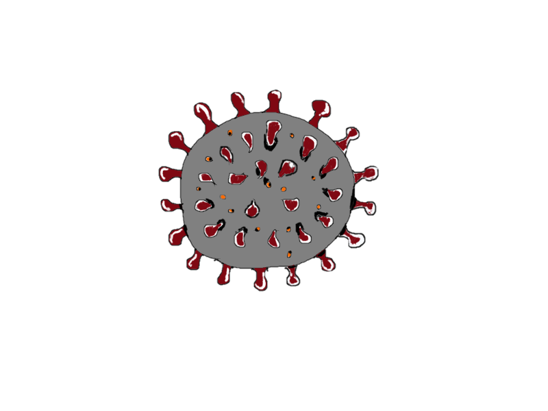

# Covid Calendar
## By Kody D., Richmond T., Sergey K. and Hannah T

### Motivation

###### The four members of the team were eager to create a web application using our shared skills in HTML, CSS and JavaScript. By creating CovidCalendar, we were able to create something new and relevant that could help people.

### Dependencies

##### Languages/Markup Used
* Pure JavaScript
* HTML
* CSS

##### API
* [COVID-19 API](https://covid19api.com/)

### Usage

* Download the contents of the CovidCalendar repository onto your local machine

* Open Title_page.html to be then redirected to the main page of CovidCalendar
* Choose a date and country from the dropdown menus provided
* View the COVID-19 data from your chosen option!

#### Difficulties

##### Working with the API

* Requesting the Data from the API had a few difficulties
	* The format of the requested data was inconsistent depending on the country, which made calculations difficult.
	* Some countries only provided information for each city. For example, Canada only provided information for each province but the entire country had "zero" cases.
